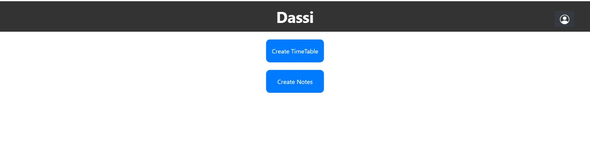
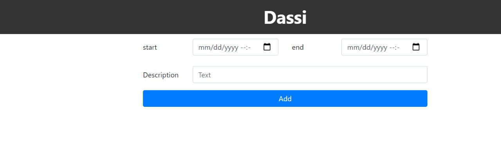
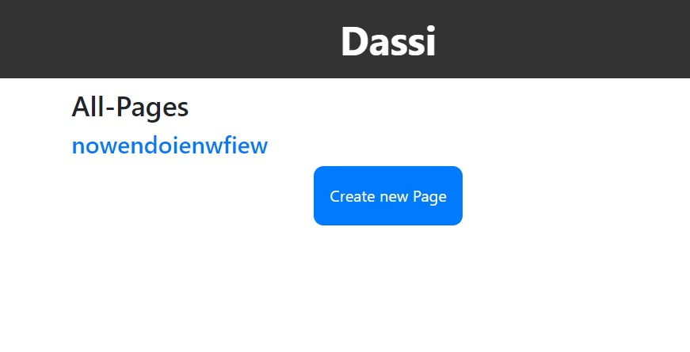
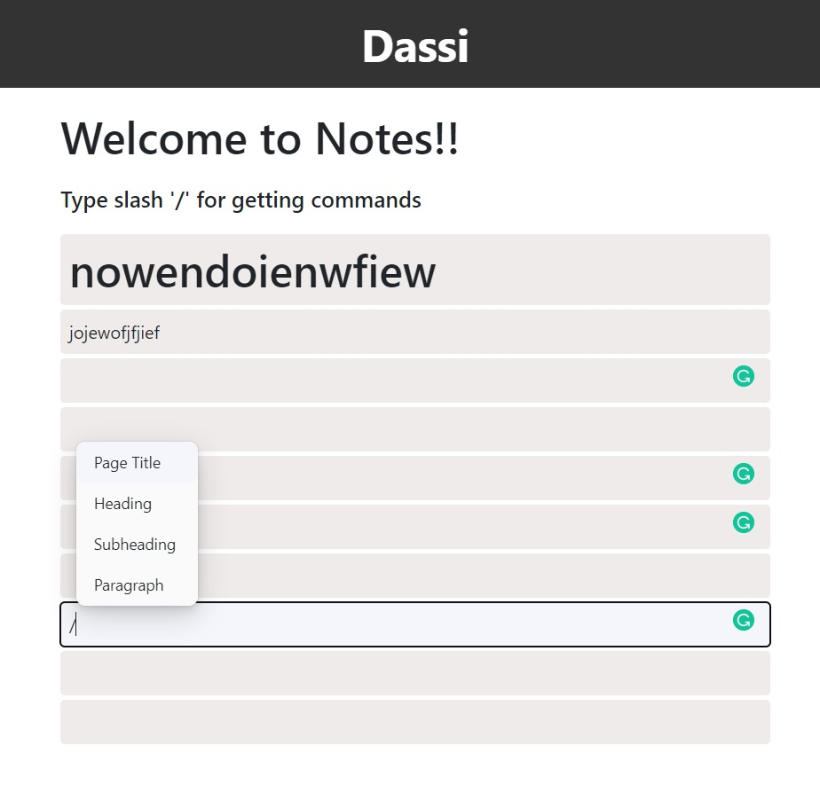
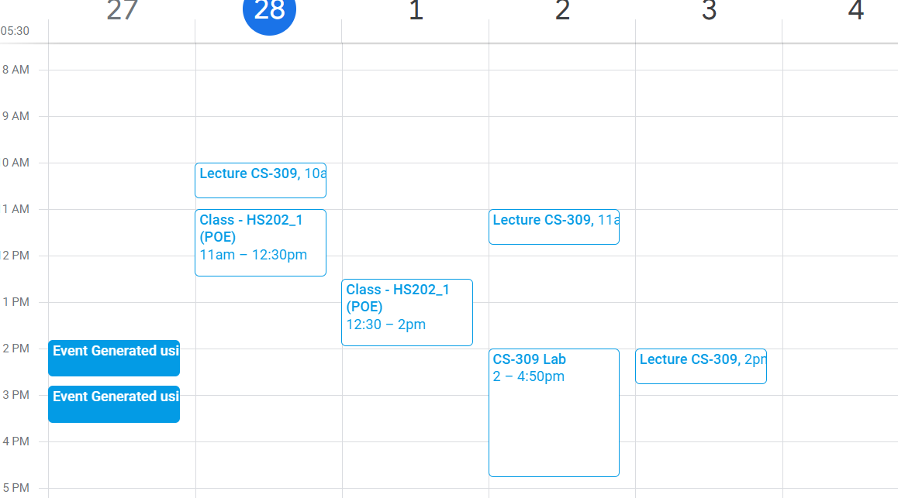

# Manageify

# What it Does
The main motive of our project is basically to increase the productivity of the user.
Keeping track of all the deadlines and not being able to remember the useful information that may be required at 
important times can be harmful for a student.

Our project focuses on both these things. We provide the facility to create calender events which will provide you 
a notification few minutes before the event.

The second important thing that our project provides is the facility to create notes.
Users can create notes, the notes can be updated or deleted as they wish.
The calendar is accessed by using the google Calendar API.

---
# Configuration

clone the repository using the command :- 
```
git clone  
```
move to the backend and configure it using:-
```
cd backend
npm install
nodemon app.js
```
for the frontend part:-
```
cd frontend
npm install
npm start
```
configure the .env file according to the given instructions:-

>MONGO_URI=*Your MongoDB URI*

>USER_NAME = *YOUR ROLL NO*

>PASSWORD = *OAS PASSWORD*

After the configuration is done you are ready to go.

---

# Images


## DashBoard


---

## CreateTimeTable 


---

## Create Notes


---

## Notes Page View


---

## Event Generated By API


---

# Tech Stack

 * The front end uses HTML,CSS,Javascipt as well as ReactJs

* For the backend We are using Python and NodeJs

* MongoDB database is used for the project.

---

# Wish To Contribute

If you wish to contribute to this project you can fork the repository and contribute in the following two ways:

* Identify a bug or an improvement and raise an issue.
* Work on existing issues and make a PR.
----------------------------------------------------------------